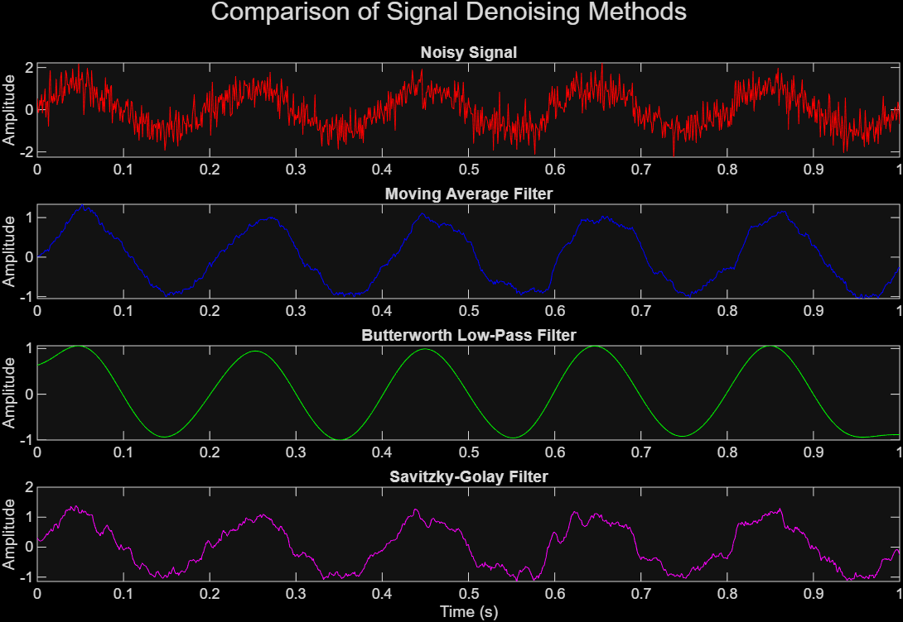

# Signal Denoising in MATLAB

Simulates and denoises a noisy sine wave using:
- Moving Average Filter
- Butterworth Low-Pass Filter
- Savitzky-Golay Filter

Useful for understanding real-world signal cleanup in electronics (e.g., sensor readings).

---

## 📊 Result

---

